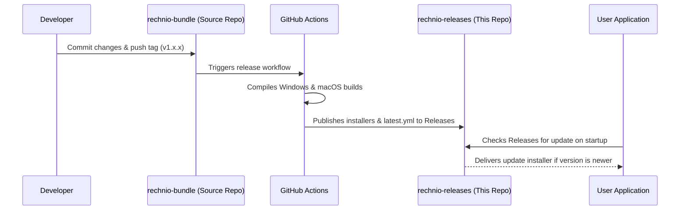

# Rechnio Releases Backend 🚀

This repository serves as the official distribution channel and automatic update server for **Rechnio** — the offline-first, local freelancer toolkit for Germany.

---

## 🔍 Why This Repository Exists

Rechnio is built on **Electron**, which uses `electron-builder` for packaging and `electron-updater` for managing automatic application updates. This repository exists for three primary reasons:

1. **Separation of Concerns**: To keep the main codebase repository ([rechnio-bundle](https://github.com/gogifemi/rechnio-bundle)) lightweight and clean by avoiding committing large compiled binary files (`.exe`, `.dmg`, etc.) to its history.
2. **Release Distribution**: To host the official installer downloads (available on the [Releases page](https://github.com/gogifemi/rechnio-releases/releases)).
3. **Auto-Update Endpoint**: To serve the automatic update metadata files (such as `latest.yml` for Windows and `latest-mac.yml` for macOS). When Rechnio starts up on a user's machine, it queries this repository's releases to check for updates.

---

## 🛠 How It Works



---

## 🚀 How to Publish a New Release

To publish a new version of Rechnio, all actions are performed in the main **[rechnio-bundle](https://github.com/gogifemi/rechnio-bundle)** repository. The process is fully automated via GitHub Actions:

### 1. Update the Version
Open `package.json` in the `rechnio-bundle` repository and update the version number:
```json
{
  "name": "rechnio",
  "version": "1.3.6"
}
```

### 2. Create and Push a Version Tag
Tag the commit with the new version (the tag MUST start with `v`):
```bash
git add package.json
git commit -m "chore: bump version to 1.3.6"
git tag v1.3.6
git push origin main
git push origin v1.3.6
```

### 3. Automatic Deployment
Once the tag is pushed to GitHub, the **Release Workflow** runs automatically:
- It compiles the code on both Windows and macOS runners.
- It automatically signs/packages the app.
- It uploads the final binaries (`Rechnio-Setup.exe`, `Rechnio.dmg`, `latest.yml`, etc.) directly to the **Releases** page of this repository.

---

## 🔧 Manual Publishing (Fallback)

If you need to manually compile and push a release from your local machine, run the following command from the root of the `rechnio-bundle` repository:

```bash
# Set your GitHub Personal Access Token (with repo write permissions)
$env:GH_TOKEN="your_github_token"

# Run the distribution/publish command
npm run dist -- --publish always
```

---

## 📦 File Reference

When a release is compiled, the following key files are generated and uploaded:

- **`Rechnio-Setup.exe`**: The Windows NSIS installer.
- **`latest.yml`**: Contains version info and file hashes for Windows auto-update.
- **`Rechnio.dmg` / `Rechnio-mac.zip`**: The macOS DMG installer and zip package.
- **`latest-mac.yml`**: Contains version info and file hashes for macOS auto-update.

---

*Made with ♥ by [gik studio](https://gikstudio.com).*